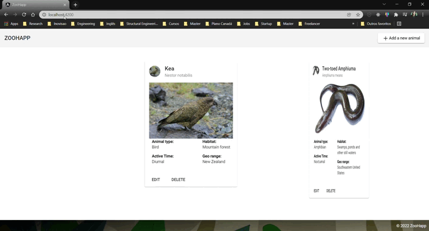

<h1 align="center"> ZooHapp <h1>

<h4 align="center">
  🚀 Happmob Frontend Test.
</h4>

  
  
  
  

  

  

  <a href="#page_with_curl-about">About</a>&nbsp;&nbsp;&nbsp;|&nbsp;&nbsp;&nbsp;
  <a href="#wrench-built-with">Built With</a>&nbsp;&nbsp;&nbsp;|&nbsp;&nbsp;&nbsp;
  <a href="#-how-to-contribute">How to Contribute</a>&nbsp;&nbsp;&nbsp;|&nbsp;&nbsp;&nbsp;
  <a href="#sweat_smile-known-issues">Known Issues</a>&nbsp;&nbsp;&nbsp;|&nbsp;&nbsp;&nbsp;
  <a href="#memo-license">License</a>

  
 ## Demonstration
  

  

  
## :page_with_curl: About
The ZooApp was created for the frontend test at Happmob. This is an App that consults the ZooAnimal API and retrieves the data on the user interface.

#### Motivation
This app was created to fulfill a code test for a junior frontend role at Happmobi.

## :wrench: Built With

- [Angular](https://angular.io/)
- [TypeScript](https://www.typescriptlang.org/)
- [JavaScript](https://www.javascript.com/)
- [ZooAnimal - API](https://zoo-animal-api.herokuapp.com/)

## 🤔 How to Contribute

- Clone the project: `git clone git@github.com:JulianaVelasques/ZooApp.git`;
- Create your branch with your feature: `git checkout -b my-feature`;
- Install the dependencies: `npm install` and `yarn add`
- Commit your feature: `git commit -m 'feat: My new feature'`;
- Push to your branch: `git push -u origin my-feature`.

After the merge of your pull request is done, you can delete your branch.
  
## :sweat_smile: Future releases:
  - Include CRUD to allow user add more animals and edit/delete.
 
## :memo: License

This project is under the MIT license. See the [LICENSE](LICENSE.md) file for more details.

---

Made with ♥ by <tr>
    <td align="center"><a href="https://github.com/JulianaVelasques"><b>Juliana Velasques</b></a> </td>
<tr>
